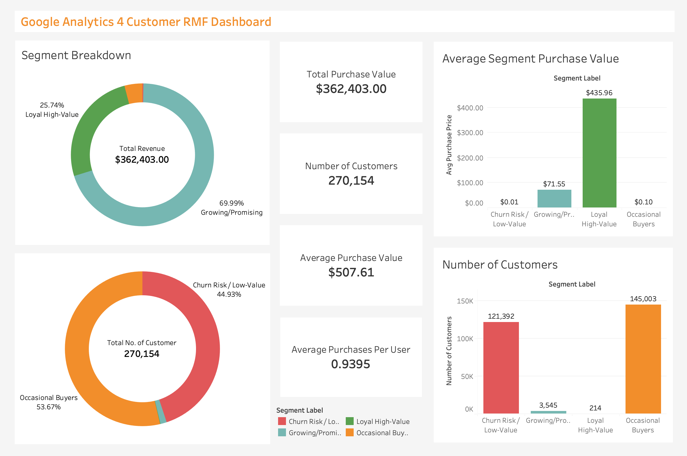

# Analysis of Google Analytics 4 Marketing Data
                         
This project evaluates digital campaign effectiveness and customer segmentation by leveraging cloud-based data engineering and analytics workflows. Using Google BigQuery for scalable SQL modeling, Python for statistical analysis, and Tableau for visualization, the pipeline transforms raw GA4 event data into actionable insights. The analysis calculates key marketing metrics (CTR, CVR, CPC, AOV), applies RFM-based clustering to segment customers, and answers five core questions around channel attribution, campaign ROI, purchase behavior, and segment value—concluding with strategic recommendations for optimizing spend allocation and targeting.
### Questions Answered
1. Which marketing channels and campaigns generate the highest baseline performance?
2. What is each channel’s incremental contribution to conversions and revenue?
3. Did specific campaign changes or launches actually cause measurable lift?
4. How can customers be segmented by value and behavior?
5. Which early behaviors predict long-term customer value (LTV)?

---

## Tools and Technologies
- **Google BigQuery (SQL)** - Cloud-based data warehouse used for querying raw GA4 event data, staging, and building fact/dimension models
- **Python** – For statistical analysis and clustering (`pandas`, `scikit-learn`), econometric modeling (`statsmodels`), data visualization (`matplotlib`), campaign KPI calculations, and CSV exports
- **Tableau** – For interactive dashboards, funnel analysis, RFM segmentation visualization, and channel attribution storytelling

---

## Project Workflow

### 1. BigQuery: Dataset & Problem Setup
Loaded the GA4 BigQuery export (Google Merchandise Store sample) and scoped the business question:
- Explored the event-level schema (nested arrays like event_params, items) and mapped UTM fields (source/medium/campaign)
- Identified core dimensions (device, country, platform) and KPI definitions (CTR, CVR, AOV, ROAS where cost exists)
- Put them into separate data frames and export them as CSV files

### 2. SQL: Data Engineering / Modeling
Built dbt-style layers in BigQuery to transform raw GA4 events into analysis-ready models:
- Built dbt-style layers to transform raw GA4 events into analysis-ready models
- raw_events → direct GA4 export reference
- stg_events → flattened parameters via UNNEST, normalized UTM fields, standardized types
- fact_campaign_performance → daily channel/campaign aggregates (impressions, clicks, sessions, conversions, revenue, CTR, CVR, AOV, ROAS)
- dim_customers → user-level rollups (country, device, platform, sessions, purchases, revenue)

**Output:** sql script for the model `ga4_dtb_project.sql` and sanity checks `sanity_checks.sql`

### 3. Python: Statistical Analysis
Using Python (pandas, statsmodels, scikit-learn, matplotlib) to quantify performance, incrementality, and audience quality:

3a. Rule-Based Attribution (Baselines)
  - Grouped by channel and campaign to compute CTR, CVR, AOV, revenue
  - Produced baseline leaderboards for quick performance triage
  **Output:** `by_channel_baseline.csv`, `by_campaign_baseline.csv`
    
3b. Regression-Based Attribution (Incremental Contribution)
  - Pivoted daily clicks by channel; regressed daily conversions on clicks + controls (DOW, trend)
  - Coefficients interpreted as marginal conversions per channel; derived attribution shares
  **Output:** `regression_attribution_channels.csv`

3c. A/B-Style Difference-in-Differences (Causal Lift)
  - Selected a treated channel (e.g., CPC) and launch/change date; defined treated vs. control and pre/post windows
  - Estimated causal lift from the treated×post interaction
  **Output:** `did_daily_conversions.csv`, `did_results.csv`

3d. Segmentation (RFM & Simple LTV)
  - Computed Recency, Frequency, Monetary at user level; ran KMeans for segments
  - Fit OLS to predict revenue from early behaviors (sessions, purchases, key events)
  - Enriched segments with device/country/platform
  **Output:** `rfm_assignments.csv`, `rfm_segment_summary.csv`, `rfm_enriched.csv`, `ltv_model_coefficients.csv`

### 4. Tableau: Data Visualization
Built stakeholder-ready dashboards in Tableau (`link`) from the CSV exports with relationships (not physical joins) to avoid row explosion:
- Channel Dashboard — channel & campaign baselines (CTR, CVR, AOV), and regression-based attribution visualizations
- Customer Segmentation Dashboard - RFM clusters, revenue contribution, LTV predictors
- Wasted Wage Bill → compared total vs wasted wages by year

 **Output:** [interactive channel dashboard](https://public.tableau.com/app/profile/matthew.david.ilomuanya/viz/ga4_marketing_channels_dashboard/Dashboard2?publish=yes), [interactive customer dashboard](https://public.tableau.com/app/profile/matthew.david.ilomuanya/viz/ga4_customer_rmf_dashboard/Dashboard1?publish=yes)
 
---
## Dashboards

---

### Question 1: Which marketing channels and campaigns generate the highest baseline performance?

The baseline data shows that **direct traffic ((direct)/(none)) dominated raw totals**, with over 52,000 impressions but a very low CTR (0.08%). Despite very low CTR (~0.076%), **direct still produced 231 conversions and ~$13.4k revenue**, with an anomalously high “CVR” of ≈578% (231/40)—a quirk of the GA4 sample where conversions can occur without ad clicks. Treat this as a conversions-per-click ratio, not a true percentage. This reflects the “catch-all” nature of direct visits: low click efficiency, but meaningful sales because returning or loyal users often fall into this bucket.

Organic and referral sources (e.g., …/organic, …/referral) also looked strong, contributing steady conversions and revenue at healthy AOV levels (~$58). These channels perform like reliable background drivers of traffic and sales without the explicit costs of paid campaigns.

By contrast, paid search (google/cpc) appeared smaller in raw totals. Impressions and clicks were modest, and while it drove some conversions, it did not rival the volume of direct or organic. This is typical in raw rollups: last-touch channels like direct and organic appear dominant, while incremental contributors like paid search look understated.

---

### Question 2: What is each channel’s incremental contribution to conversions and revenue?

The regression-based attribution reshuffles the leaderboard. While direct and organic looked strongest in raw totals, the incremental model shows paid search (google/cpc) accounts for ~45% of marginal conversions—the single largest driver once overlapping exposures are controlled for. This highlights paid search as the workhorse: additional CPC clicks reliably produce additional conversions.

Organic traffic (<Other>/organic) captures ~23% of incremental share, suggesting genuine value, though lower than the raw rollups implied. Referral traffic (googlemerchandisestore.com/referral) holds ~10%, indicating steady but secondary contribution. Direct visits ((none)/(none)) shrink to ~8%, reflecting that much of their apparent strength in the baselines is overlap with other channels. Meanwhile, google/organic contributes near-zero incrementally, suggesting those sales are likely influenced by exposures elsewhere.

---

### Question 3: Did specific campaign changes or launches actually cause measurable lift?

The difference-in-differences test focused on **google/cpc, treated as a new campaign beginning on 2020-12-15**. The regression shows a **significant positive interaction** (treated × post = +23.6 conversions/day, p = 0.004). This indicates that **CPC generated real incremental lift** beyond what would have occurred from background trends.

Looking at averages, the control group fell sharply from ~60.2 to 37.2 conversions/day after mid-December, reflecting a general market slowdown. By contrast, CPC jumped from ~0.05 to 0.63 conversions/day in the same period. The main effect for “post” was strongly negative (−38.9), showing that overall demand dropped, but the treated × post term demonstrates that CPC rose against this tide.

---

### Question 4: How can customers be segmented by value and behavior?

The RFM segmentation reveals a classic Pareto-style imbalance: a small minority of users generate the bulk of revenue. Two standout clusters dominate. **“Growing/Promising” users** (cluster 3, ≈3,545 customers) contribute ≈$253.6k in revenue with moderate average spend (≈$72 each). Meanwhile, the **“Loyal High-Value”** group (cluster 2, ≈214 customers), though tiny in size, generates ≈$93.3k in revenue thanks to an exceptional average order value (≈$436).

By contrast, the vast majority of users fall into low-value clusters. “Occasional Buyers” (cluster 0, ≈145,000 customers) contribute only ≈$14.7k in revenue, while “Churn Risk / Low-Value” (cluster 1, ≈121,000 customers) are essentially inactive, accounting for less than $1k in total spend.

---

### Question 5: Which early behaviors predict long-term customer value (LTV)?
The simple LTV regression highlights a clear signal: **early purchases are by far the strongest predictor of long-term value**. The coefficient for early purchases is ≈70.7 and highly significant, meaning that customers who transact early are overwhelmingly more likely to contribute substantial revenue over their lifetime.

Secondary predictors add nuance. Early events (≈0.044, significant) also correlate positively with revenue, reflecting that engagement signals—browsing, cart adds, or product views—matter for forecasting value. Early sessions show a borderline effect (p ≈ 0.052), suggesting that sheer visits alone are less reliable unless paired with transactions or deeper engagement. Days since first seen carries only a small positive effect, indicating that **longevity without early purchases does little to drive value**.

---
### Business Conclusions & Recommendations Based on Data
#### 1. Raw performance favors organic, referral, and direct traffic — but risks overstating their value
Baseline aggregates showed direct visits drove ≈231 conversions and $13.3k in revenue, while organic and referral sources appeared consistently strong. At face value, this would suggest doubling down on “free” channels. However, because these rollups are last-touch, they over-credit channels that appear at the end of the funnel and understate incremental contributors.

**Best practice:** Use baseline leaderboards for quick diagnostics, but avoid making budget decisions on raw totals alone.

#### 2. Paid search (CPC) is the true workhorse for incremental lift
Regression-based attribution revealed that google/cpc accounted for ≈45% of incremental conversions, far outpacing organic (≈23%) and referral (≈10%). Direct shrank to ≈8% once overlaps were controlled for. This shows that while paid search may not dominate in raw counts, its clicks consistently generate unique new conversions.

**Best practice:** Treat paid search as a core driver of incremental growth and ensure budget allocations reflect its outsized marginal impact.

#### 3. Paid search delivers causal lift, even in soft markets
The DiD analysis showed that after the CPC launch on 2020-12-15, conversions rose by ≈23.6/day (p=0.004) despite an overall market decline of ≈−39/day. CPC effectively shielded performance when organic demand dropped.

**Best Practice:** Maintain or increase paid investment during seasonal downturns — it can offset market weakness and prevent steeper revenue declines.

#### 4. High-value users are a small minority, and retention is critical
RFM segmentation showed that Loyal High-Value (≈214 customers, $93k revenue) and Growing/Promising (≈3,545 customers, $253k revenue) users generated the majority of sales, while over 260k Occasional/Low-Value customers added < $16k combined.

**Best practice:** Prioritize retention and upsell strategies for high-value clusters and nurture “promising” users into loyal buyers. Broad campaigns across the low-value base have limited ROI.

#### 5. Early purchases are the strongest predictor of lifetime value.
The LTV regression confirmed that early purchases (coef ≈70.7, highly significant) far outweigh other predictors, with early events and engagement adding smaller signals.

**Best practice:** Optimize campaigns and onboarding flows to secure a first purchase quickly. Discounts for first-time buyers, frictionless checkout, and personalized follow-ups can lock in future revenue.

---
### Strategic Takeaway
Together, these findings suggest a best-practice marketing strategy that balances paid search for incremental lift, doubles down on early conversion, and invests in high-value customer retention. Broad top-of-funnel spend without targeting or follow-through will be less efficient than focusing resources on channels and users proven to drive durable revenue.

---

## Author
**Matthew-David Ilomuanya**  
Data Analyst & Researcher  
[LinkedIn](https://www.linkedin.com/in/matthew-david-ilomuanya-2498101a5/) | Portfolio Website
